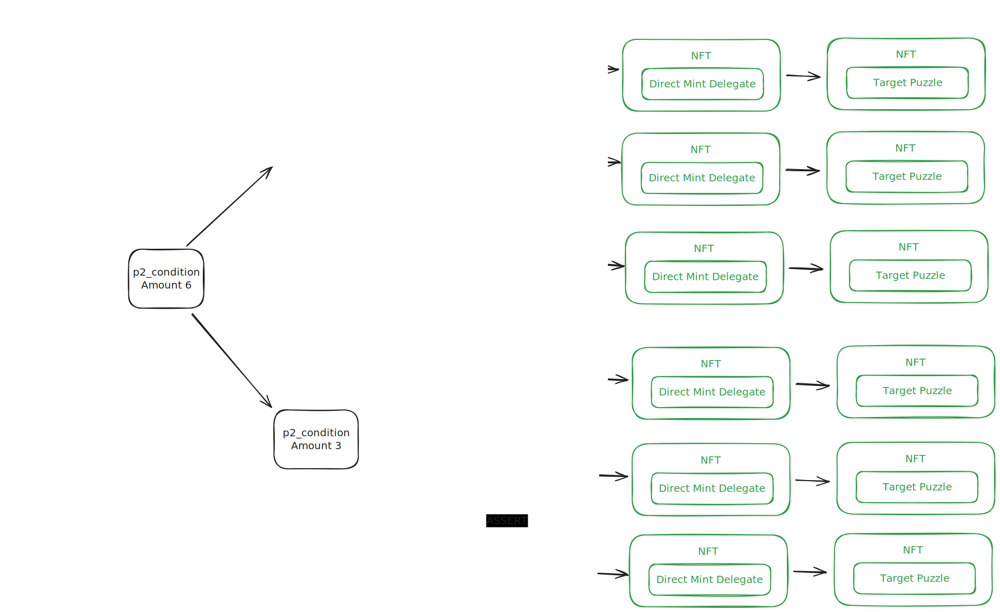

Secure the Mint
=======

A way to create many NFTs on the Chia blockchain in a on-demand fashion, based on Secure the Bag.

Background
-------

For provenance reasons, a lot of NFTs on Chia are associated with the Decentralized Identity (DID) of the creator.

The state-of-the-art way of bulk minting NFTs on Chia is to mint 25 pieces per block using the `nft_mint_bulk` RPC endpoint in the Chia wallet.
It associates the NFTs to a particular DID by having the DID coin as the parent coin of the NFTs itself.

The [Chia NFT bulk minting tool](https://docs.chia.net/guides/nft-bulk-mint/) is built around this endpoint and automates the minting for large collections.

However, this method requires the creators to actively mint the NFTs themselves, since their DID has to be spent for each batch being minted.

Secure the Mint removes this requirement by precommitting a whole collection of NFTs using a single DID spend.
This method is based on Secure the bag, which is designed to distribute coins to a lot of addresses.
It works by precommitting a single root coin and then allowing anyone to unroll it on demand.

You can learn more about Secure the bag in [this article](https://bitcoinmagazine.com/technical/secure-the-bag-cutting-transactions-in-half-to-resolve-bitcoin-network-congestion).

### Secure the Mint

Secure the mint works very similar to Secure the bag.

Based on the NFT metadata provided by the creator, it precomputes all the NFT puzzles that will be part of the collection.
It then computes a tree of fixed coin spends to unroll those NFTs, resulting in a single root coin.
This root coin is then created by the DID of the creator, locking the whole collection into place.

Now anyone can unroll this root coin, if they know the collection metadata.



This is already a big improvement over the current bulk minter, since unrolling the tree can be outsourced to anyone and the creator doesn't have to authorize each bundle individually.
The DID can also be used to do other things in the mean time.
### Secure the Mint + Offer Files

The magic happens when we combine this method with offer files.

Using the offer delegate puzzle, the creator is able to precommit the NFTs with a payment condition.
So anyone can unroll the NFT and effectively mint it, but only if they pay the creator a predefined amount of XCH.

Both the minting and the payment spends can now be bundled into an offer file that directly mints the NFT when a user takes the offer.


### Technical details

The tricky thing when precommitting singletons is that singleton launchers are inherently insecure, so they have to be protected by asserting the singleton eve spend in the spend that creates the launcher.

But this requires one to know the launcher ID of the singleton, which is not known yet if you only precompute puzzle hashes.

With the help of trepca, I came up with a[Pre-Launcher puzzle](secure_the_mint/puzzles/secure_the_mint_launcher.clsp) that computes those assertions based on its own ID, which is passed in as the solution.

As for the NFT itself, the inner puzzle can be anything. However, since the eve spend has to be asserted by the pre-launcher, I'm using a special [p2_conditions puzzle](secure_the_mint/puzzles/secure_the_mint_p2_conditions.clsp) that creates this assertion and adds it to the other conditions.

To make things easier, I have prepared two delegate puzzles to be used in the NFT.
The [direct delegate puzzle](secure_the_mint/puzzles/secure_the_mint_direct_delegate.clsp) is used to mint NFTs into a particular wallet while the  [offer delegate puzzle](secure_the_mint/puzzles/secure_the_mint_offer_delegate.clsp) forces the NFT to be part of an offer with fixed conditions.

### Design decisions

#### Precommitted NFTs can either be minted or melted, not modified

To keep things simple, the pre-launcher only has two modes. It can either mint the NFT with the predefined conditions, or it can be melted by the creator, effectively destroying it and preventing the NFT to be minted.

I thought about allowing the creator to modify the NFT afterwards, but that's probably not worth the effort, since the creator can always commit new NFTs to chain and melt the old ones.

### The root coin has an amount of 0, but its children have higher amounts

This decision was to ensure the root coin can always be created by the DID coin. Since the DID coin is a singleton, additional coins created by it have to be even values. So it would not be possible to mint collections with uneven number of NFTs.

So I decided that the person unrolling the bundle has to fund the missing mojos (1 per NFT) when unrolling the root coin.

Install
-------

**Ubuntu/MacOSs**

```
git clone https://github.com/MintGarden_io/secure-the-mint.git
cd secure-the-mint
python3 -m venv venv
. ./venv/bin/activate
python -m pip install --upgrade pip setuptools wheel
pip install .
```

(If you're on an M1 Mac, make sure you are running an ARM64 native python virtual environment)

**Windows Powershell**

```
git clone https://github.com/MintGarden_io/secure-the-mint.git
cd secure-the-mint
py -m venv venv
./venv/Scripts/activate
python -m pip install --upgrade pip setuptools wheel
pip install .
```

Lastly this requires a synced, running light wallet

Verify the installation was successful

```
secure_the_bag --help
unwind_the_bag --help
```

Usage
-------

**WARNING: THIS PROJECT HAS NOT BEEN REVIEWED YET. USE AT YOUR OWN RISK**

### Securing the Bag

Prepare a `metadata.csv` file containing the NFT metadata.
It shares the format with the [Chia NFT bulk minting tool](https://docs.chia.net/guides/nft-bulk-mint/), you can find an
example under [tests/secure_the_mint/metadata.csv](tests/secure_the_mint/metadata.csv).

Compute the root coin puzzle by running
```shell
$ secure_the_bag --metadata metadata.csv -leaf-width 100

Secure the bag root amount: 100 mojos
Secure the bag root address: xch1ylq696pt5mlnu9msvsshfvrpcz8vr5r8ekpk7thw56g3n2rraxgqzcta5x
```
This will give you a root puzzle hash of your NFT tree.

### Committing the Bag

Get the inner address of your DID
```shell
$ chia rpc wallet did_get_info '{"coin_id": "did:chia:1uv8a5088n2w5n447lga8ylnrjuuq5q2swu4hauqa00e2uvxspu7qc6d0d4", "latest": true}' | jq '.hints[0]' | xargs -L 1 cdv encode

xch17vvgz7g8xe3wkf5rk7gmyhgamxc4ja0r4htndrwqe5hdd523qzyqzwwtnz
```
Spend your DID and create the root coin
```shell
chia rpc wallet did_transfer_did '{"wallet_id": 2, "inner_address": "xch17vvgz7g8xe3wkf5rk7gmyhgamxc4ja0r4htndrwqe5hdd523qzyqzwwtnz", "fee": 1000000000, "with_recovery_info": true, "extra
_conditions": [{"opcode": 51, "args": {"puzzle_hash": "27c1a2e82ba6ff3e1770642174b061c08ec1d067cd836f2eeea69119a863e990", "amount": 0}}]}'
```
### Unwinding the Bag

**This is currently not possible with the Chia reference wallet, since it doesn't allow leaving mojos on the table to be captured by other coins.**

Get the spent DID coin ID:
```
$ cdv rpc coinrecords --by puzzlehash 27c1a2e82ba6ff3e1770642174b061c08ec1d067cd836f2eeea69119a863e990 -nd
```
Unwind the bag
```shell
$ unwind_the_bag --metadata metadata.csv --leaf-width 100 --wallet-id 1 --did-coin-id 6d720d9c49f592ea38230ed7e02cb274ecb07f791d937d060c19c27d1d6d27bf --fingerprint 1105744144
```